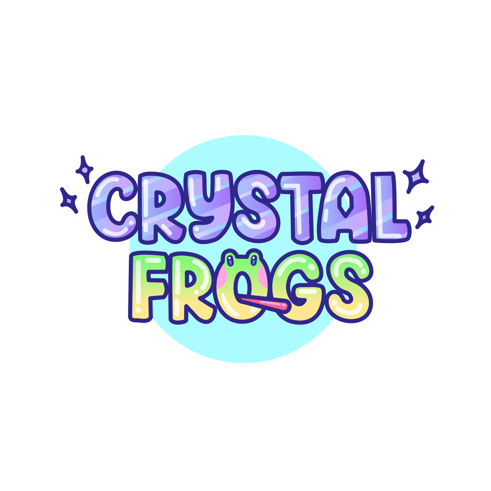

# Crystal Frogs - Community-Driven Animated NFT Series

## Table of Contents

- [Motivation](#motivation)
- [Project Description](#project-description)
- [Crystal Staking Platform](#crystal-staking-platform)
- [User Interface and Features](#user-interface-and-features)
- [Problem Solved](#problem-solved)
- [Learning Experience](#learning-experience)
- [What Makes Crystal Frogs Stand Out](#what-makes-crystal-frogs-stand-out)
- [Features](#features)
- [Getting Started](#getting-started)
- [License](#license)
- [Acknowledgments](#acknowledgments)

## Getting Started

### Visit our [Website](https://www.crystalfrogs.com/)

### Check out our [Genesis Collection](https://opensea.io/collection/crystalfrogsofficial)

Ethereum Mainnet Contract: [0x78627C6798b9Db51Ca48dea1ff6ce0f5C5a66F81](https://etherscan.io/address/0x78627c6798b9db51ca48dea1ff6ce0f5c5a66f81)

### & our [Gen 2 Collection](https://opensea.io/collection/crystalfrogsgen2)

Ethereum Mainnet Contract: [0xC71d1c1F36c21812296443fffFF67E1f4AD5239b](https://etherscan.io/address/0xc71d1c1f36c21812296443fffff67e1f4ad5239b)

### Join our [Discord](https://discord.gg/crystalfrogs)

### Follow us on [Twitter](https://twitter.com/crystalfrogsnft)

### Read our [Medium](https://medium.com/@crystalfrogsnft)

## Motivation

The motivation behind Crystal Frogs was to create a unique and engaging animated NFT (Non-Fungible Token) series on the Ethereum blockchain that represents characters in an upcoming animated series. The collection consists of 400 Founding Frogs and 4600 Gen 2 Frogs programmatically generated from hundreds of illustrated traits, they are qualified to earn rewards and upgrades in the Crystal Frogs Universe.

## Project Description

Crystal Frogs is a full-stack web application that serves as a platform for the community-driven creation, ownership, and trading of NFTs for an animated show. The application is built using Next.js, custom React components, and web3.js integration with Alchemy to ensure a seamless user experience. The project focuses on several key components:

1. **NFT Creation and Ownership:** Crystal Frogs allows users to mint their own unique animated frog NFTs, each with distinct attributes and characteristics. Owning these NFTs grants users exclusive access to the Crystal Frogs community and its various events.

2. **Responsive and Intuitive Design:** The application boasts a responsive front-end design with Tailwind CSS, adhering to material design principles. This ensures an intuitive and visually appealing interface, enhancing the user experience across different devices.

3. **Secure Allowlist Functionality:** To maintain the security and integrity of the community, a Solidity smart contract with Merkle proof cryptography has been optimized and deployed. This allows for secure allowlist functionality during the minting process, preventing unauthorized access.

4. **Whitelisted Minting Phases:** The minting process is divided into several phases: a free sale mint, a pre-sale mint (with a limit), and a public sale mint. Each phase has its own specific pricing and availability based on the user's address and the Merkle proof provided.

## Crystal Staking Platform

Crystal Frogs will be complemented by the upcoming Crystal Staking Platform, which will introduce a native ERC20 token called Crystal. The Crystal token will be launched alongside the staking platform, providing various utilities and benefits to Crystal Frog holders. The staking platform will allow Crystal Frog holders to yield Crystal tokens each day based on the tier of frogs they hold. The tiers of frogs will have different staking rates, enabling users to accumulate Crystal over time.

## User Interface and Features

As part of the staking platform, a user interface is being developed to provide seamless interactions with Crystal Frogs and Crystal tokens. The user interface will enable Crystal Frog holders to:

- **Connect Web3 Wallets:** Holders can easily connect their web3 wallets to the platform to access their Crystal Frogs and Crystal tokens.

- **Validate Crystal Frog NFTs:** The interface will validate the ownership of Crystal Frog NFTs to ensure eligibility for staking and other platform features.

- **View Crystal Balance:** Users can view their Crystal token balance, which accumulates daily based on the staking rate of their held Crystal Frogs.

- **Interact with Crystal Frogs in a Room:** Crystal Frog holders will be able to interact with their NFTs in a virtual room, adding an element of fun and engagement to the experience.

## Problem Solved

Crystal Frogs and the upcoming Crystal Staking Platform address the need for a creative and community-oriented platform for the creation and trading of animated NFTs. By introducing the Crystal token and staking mechanism, the platform adds utility and incentives for holding and collecting Crystal Frogs, fostering a vibrant and loyal community.

## Learning Experience

During the development of Crystal Frogs and the Crystal Staking Platform, I had the opportunity to delve into more complex smart contract design, including the implementation of the ERC20 token standard. The staking mechanism allowed me to explore new ways of incentivizing and rewarding community participation.

## What Makes Crystal Frogs Stand Out

Crystal Frogs stands out from other NFT projects due to the following reasons:

1. **Community Driven Show:** Unlike traditional NFTs, Crystal Frogs offers upgradeable NFTs that bring life and personality to each individual token, making them more engaging and enjoyable for collectors. As a Founding Frog holder, you have exclusive access to our pitch deck development, VIP events, and a daily yield of crystals through our upcoming staking platform.

2. **Community Focus:** The project places a strong emphasis on community involvement, with features like allow listing, staking, and interactive rooms that prioritize fair access and active participation.

3. **Crystal Token and Staking Platform:** The introduction of the Crystal token and the staking platform adds utility and rewards for Crystal Frog holders, providing additional incentives for community members.

4. **Secure Smart Contract:** The optimized Solidity smart contract with Merkle-proof cryptography ensures secure and tamper-resistant allowlist functionality, enhancing the trustworthiness of the minting process.

## Features

- **NFT Creation:** Users can mint their own unique animated frog NFTs.
- **Responsive Design:** The application offers a responsive front-end design using Tailwind CSS.
- **Secure Allowlist:** The smart contract incorporates Merkle-proof cryptography to provide secure allowlist functionality.
- **Multiple Minting Phases:** The minting process includes free-sale, pre-sale, and public sale phases, each with different rules and limitations.
- **Crystal Staking Platform:** Crystal Frog holders can stake their NFTs to earn Crystal tokens daily.
- **User Interface:** A user-friendly interface is being developed to enable seamless interactions with Crystal Frogs and Crystal tokens.

## License

This project is licensed under the Apache License, Version 2.0 - see the [LICENSE](LICENSE.md) file for details. You may use this code in part or whole to create a template for your project. You cannot use the code in whole or part to recreate this project. This project including any of the specific copyrights or trademarks of it, unique artwork, or other identifying features. You may create similar projects that have similar code functionality but this license does not grant the right to copy this project. This license grant is limited to the code and smart contract.

## Acknowledgments

I would like to thank the entire Crystal Frogs community for their support and feedback during the development of this project. Special thanks to the OpenZeppelin team for their excellent smart contract libraries, which were instrumental in the creation of the secure allowlist functionality.

---

Thank you for taking the time to explore Crystal Frogs. Ribbit! 🐸🌟
